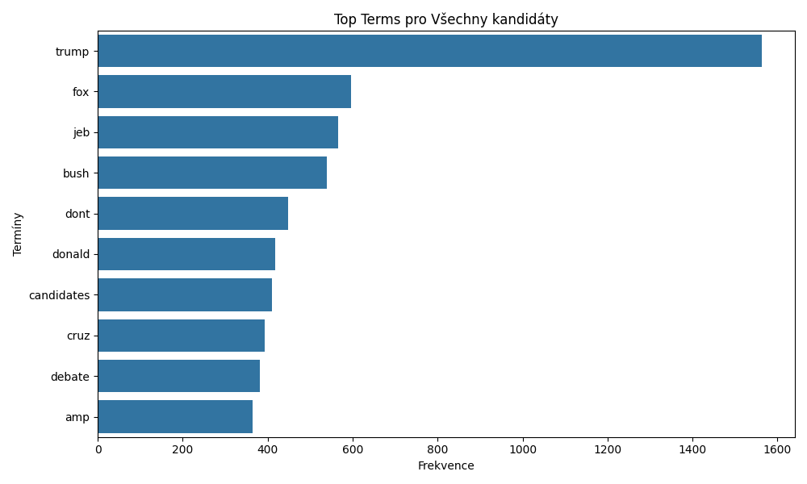
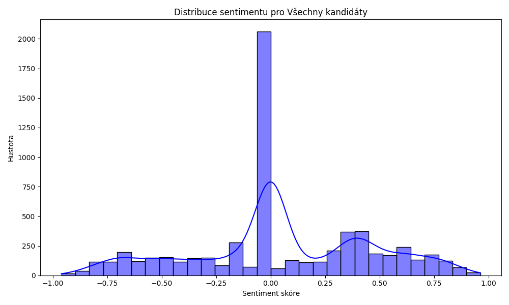

Install dependencies:  
```python
pip install -r requirements.txt
``` 
Can be run with:  
```python
python src/main.py
```
<p align="center">

&nbsp; &nbsp; &nbsp; &nbsp;

</p>

# Výsledky témat classification:
| topic_id | top_words                                                                                     |
|----------|-----------------------------------------------------------------------------------------------|
| 0        | gopdebate, rt, gopdebates, http, amp, fair, megynkelly, debate, balanced, rwsurfergirl        |
| 1        | gopdebates, rt, gopdebate, rwsurfergirl, jeb, trump, candidates, ask, http, don              |
| 2        | rt, gopdebate, gopdebates, http, rwsurfergirl, fox, realdonaldtrump, republican, trying, news |
| 3        | gopdebate, rt, rwsurfergirl, gopdebates, trump, http, news, face, fox, think                 |
| 4        | rt, gopdebate, gopdebates, http, military, huckabee, things, people, kill, mike              |

# Výsledky predikce sentimentu kandidátů:

Keyword pro concordance je win.  
  
| candidate              | mean_sentiment | median_sentiment | positive_percentage | neutral_percentage | negative_percentage | total_tweets | top_terms                                                                                      | collocations                                                                                                                                                                                                 | concordance                                                                                                                                                                                                                                                                                                                                                                                                                                                                                                                                                                  |
|------------------------|----------------|------------------|---------------------|---------------------|---------------------|--------------|------------------------------------------------------------------------------------------------|-------------------------------------------------------------------------------------------------------------------------------------------------------------------------------------------------------------|------------------------------------------------------------------------------------------------------------------------------------------------------------------------------------------------------------------------------------------------------------------------------------------------------------------------------------------------------------------------------------------------------------------------------------------------------------------------------------------------------------|
| Scott Walker           | -0.056845      | 0.00000          | 32.818533           | 28.571429           | 38.610039           | 259          | [walker, scott, wisconsin, koch, amp, like, walkers, know, abortion, state]                    | [scott walker (83), last night (11), koch brothers (10), walker nothing (10), walker god (10), god cutting (10), cutting budget (10), budget talk (10), state wisconsin (10), walker dont (9)]                                                                                                                                               | []                                                                                                                                                                                                                                                                                                                                                                                                                                                                                                                                                                        |
| Donald Trump           | 0.065749       | 0.00000          | 40.170636           | 31.567721           | 28.261642           | 2813         | [trump, fox, donald, candidates, news, debate, dont, ask, attack, like]                        | [donald trump (299), fox news (220), candidates dont (128), dont attack (128), attack fox (128), fox stoping (128), stoping speaking (128), thanks fox (91), news youre (91), youre raising (91)]                                                                                                                                            | [Context: him out but he will **win** the same, Context: trumpkins your hero didnt even **win** the steak knives last night, Context: they support me when i **win** the nominatio, Context: trumpcarson ticket would **win** in a landslide, Context: idol you know he wont ever **win** but youre curious to see, Context: is paying off people to **win** debates now, Context: an independent the republicans cant **win** either, Context: her a bimbo this should **win** him the movieshoote, Context: we dont **win** anymore we lose to china, Context: and gave him a big **win** with it] |
| Ted Cruz               | 0.050097       | 0.00000          | 34.850863           | 29.356358           | 35.792779           | 637          | [cruz, ted, need, trump, rubio, get, think, rid, bush, band]                                     | [cruz trump (123), get rid (119), think cruz (117), trump need (117), need band (117), band together (117), together expose (117), expose set (117), set job (117), job get (117)]                                                                                                                                                       | [Context: but if were going to **win** in 2016 we need a, Context: or cruz ticket for the **win** h, Context: or cruz ticket for the **win** , Context: cruz if were going to **win** in 2016 we need a]                                                                                                                                                                                                                                                                               |
| Ben Carson             | 0.139694       | 0.06715          | 50.742574           | 25.990099           | 23.267327           | 404          | [carson, ben, amp, like, brain, best, racism, think, race, man]                                 | [ben carson (152), carson carson (22), half brain (14), amp ben (12), carly fiorina (12), carson amp (11), amp marco (11), marco rubio (11), fiorina amp (11), carson remark (11)]                                                                                                    | [Context: i mean he wont ever **win** but he just sounds sad]                                                                                                                                                                                                                                                                                                                                                                                                                                                                                                           |
| Mike Huckabee          | -0.082205      | 0.00000          | 28.498728           | 31.806616           | 39.694656           | 393          | [huckabee, military, people, kill, break, purpose, thingsmike, mike, things, pimps]              | [kill people (87), people break (86), military kill (77), purpose military (76), break thingsmike (59), thingsmike huckabee (59), mike huckabee (48), huckabee purpose (43), huckabee huckabee (41), break things (29)]                                                                                      | []                                                                                                                                                                                                                                                                                                                                                                                                                                                                                                                                                                        |
| Jeb Bush               | 0.016546       | 0.00000          | 27.092199           | 55.744681           | 17.163121           | 705          | [jeb, bush, dont, reminds, elevator, music, hear, listen, fox, gets]                           | [jeb bush (301), bush reminds (165), reminds elevator (164), elevator music (164), music hear (164), hear dont (164), dont listen (164), fox cherry (113), cherry picking (113), picking candidates (113)]                                                                                     | [Context: he wanted a repub to **win** , Context: night that wants bush to **win** gave him softballs all night]                                                                                                                                                                                                                                                                                                                                                                                                                                                            |
| Chris Christie         | -0.015785      | 0.00000          | 47.098976           | 17.406143           | 35.494881           | 293          | [christie, chris, tonight, rights, thinks, learned, remove, civil, fight, terrorism]            | [chris christie (83), tonight learned (43), learned thinks (43), thinks remove (43), remove civil (43), civil rights (43), rights fight (43), fight terrorism (43), terrorism tonight (37), hugged obama (36)]                                                                                      | []                                                                                                                                                                                                                                                                                                                                                                                                                                                                                                                                                                        |
| Marco Rubio            | 0.195227       | 0.24810          | 56.000000           | 23.636364           | 20.363636           | 275          | [rubio, marco, god, night, last, amp, candidates, one, good, blessed]                           | [marco rubio (64), last night (19), god blessed (12), rubio god (10), find one (8), marco rubios (8), even find (7), rubios ears (7), shut fuck (7), republican party (6)]                                                                                                       | [Context: new game 1 person cant **win** players close eyes amp try, Context: rubio you aint gon na **win** ]                                                                                                                                                                                                                                                                                                                                                                                                                                                                |
| Rand Paul             | 0.005128       | 0.00000          | 29.657795           | 37.642586           | 32.699620           | 263          | [rand, paul, hair, debate, christie, last, got, pauls, amp, time]                               | [rand paul (103), rand pauls (17), last night (11), pauls hair (10), ive got (10), paul gone (8), gone ive (8), got curly (8), curly hair (8), hair dropped (8)]                                                                                                                   | []                                                                                                                                                                                                                                                                                                                                                                                                                                                                                                                                                                        |
| John Kasich            | 0.201092       | 0.08260          | 50.413223           | 31.818182           | 17.768595           | 242          | [kasich, john, gay, like, hes, sense, last, marriage, debate, mailman]                           | [john kasich (42), kasich aware (10), aware hes (10), hes making (10), making sense (10), gay marriage (9), dad mailman (9), last nights (7), last night (7), kasichs dad (7)]                                                                                                    | [Context: hole is ohio republicans must **win** ohio, Context: talking sense he will never **win** the primary, Context:  **win** and you know it roger, Context: common sense bam for the **win** thats a christian, Context: its enough to **win** center hes fantastic, Context: i do kasich came to **win** , Context: i do kasich came to **win** ]                                                                                                                                      |
| No candidate mentioned | 0.053630       | 0.00000          | 38.781031           | 32.845321           | 28.373647           | 6284         | [trump, fox, jeb, bush, dont, donald, candidates, cruz, debate, amp]                            | [jeb bush (307), donald trump (305), fox news (232), bush reminds (165), get rid (164), reminds elevator (164), elevator music (164), music hear (164), hear dont (164), dont listen (164)]                                                                                                  | [Context: him out but he will **win** the same, Context: trumpkins your hero didnt even **win** the steak knives last night, Context: they support me when i **win** the nominatio, Context: trumpcarson ticket would **win** in a landslide, Context: new game 1 person cant **win** players close eyes amp try, Context: idol you know he wont ever **win** but youre curious to see, Context: but if were going to **win** in 2016 we need a, Context: is paying off people to **win** debates now, Context: an independent the republicans cant **win** either, Context: rubio you aint gon na **win** ] |
  
### Lze pouze na základě sentimentu predikovat výsledek voleb ?  
Sentiment ukazuje, jak jsou kandidáti vnímáni na sociálních médiích – pozitivní sentiment může naznačovat popularitu nebo podporu, ale sám o sobě nepredikuje volební úspěch.